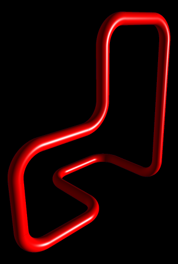

# Spielanleitung

*Hinweis: Diese Spielanleitung kann auch als PDF-Datei heruntergeladen werden: [Download Spielanleitung]({{site.baseurl}}doc/Spielanleitung.pdf).*

## Einleitung

Willkommen bei dem großartigem Spiel für alle Kreativen und Knobelwilligen. Knot&sup3; dir die Möglichkeit aus einem minimalen Ausgangsknoten ein komplexes Gebilde zu schaffen, das andere in Erstaunen versetzt. Dabei sind der Kreativität kaum Grenzen gesetzt und heißt damit auch zurecht im Spiel Creative Mode.

Wer etwas mehr Herausforderungen sucht und tolle Knoten anderer Spieler auf Zeit nachbauen will, für den ist der Challenge Mode. Man Kann auch eigene Herausforderungen erstellen, aber dazu später mehr.

## Standard Tastaturbelegung

Kamerasteuerung: Die Kamera lässt sich mit der Tastatur und durch gedrückt halten der rechten Maustaste steuern.

| Tastenkombination          | Ausgeführte Aktion                                |
| -------------------------- | ------------------------------------------------- |
| W bzw. S                   | Bewegt die Kamera in den Raum hinein bzw. hinaus. |
| A bzw. D                   | Bewegt die Kamera nach links und rechts.          |
| R bzw. F                   | Bewegt die Kamera nach oben und unten.            |
| Pfeiltasten Links / Rechts | Drehen die Kamera um die Z-Achse. Dabei wird zunächst die Kante, die der Maus am nächsten ist in den Fokus gerückt. |
| Pfeiltasten Hoch / Runter  | Ändert den Winkel der Kamera zu XY-Ebene. Es neigt die Kamera. Dabei wird zunächst die Kante, die der Maus am nächsten ist in den Fokus gerückt. |
| Q bzw. E                   | Zoomt die Kamera rein bzw. raus.                  |
| Enter                      | Setzt die Kamera zurück.                          |
| Rechte Maustaste           | Durch das gedrückt halten kann man die Kamera sowohl drehen als auch neigen. Dabei wird zunächst die Kante, die der Maus am nächsten ist in den Fokus gerückt. |
| Mausrad                    | Zoomt die Kamera rein bzw. raus.                  |

Kanten Selektieren:

| Tastenkombination          | Ausgeführte Aktion                                |
| -------------------------- | ------------------------------------------------- |
| Linke Maustaste            | Ein Klick auf eine nicht selektierte Kante fügt diese zur Selektion hinzu. Ein Klick in den leeren Raum hebt alle Selektionen auf. |
| Strg + Linke Maustaste     | Ein Klick auf eine Kante fügt diese zur Selektion hinzu.                   |
| Shift + Linke Maustaste    | Ein Klick auf eine Kante fügt alle von der zuletzt markierten bis zur aktuellen zur Selektion hinzu. |

Kanten Bewegen:
>   Durch gedrückt halten der linken Maustaste beginnen auf einer
    Selektierten Kante oder einem Pfeil, der sich im Menü einschalten
    lässt, lässt sich die Auswahl Bewegen.

Esc:
>   Öffnet im Spiel das Pausenmenü.

C:
>   Ermöglicht das Färben markierter Kanten.

F11:
>   Wechselt in den Vollbildmodus.

## Menüführung

Beim Start des Spiels landet man im Hauptmenü. Dort hat man die Auswahl zu:

Creative:
:   Hier dreht sich alles um das Erstellen und neuer Inhalte. Man kann einen neuen Knoten erstellen beginnend vom minimalen Knoten oder bereits erstellte laden und weiter bearbeiten. Hier sind auch schon ein paar Knoten zur Inspiration mitgeliefert. Auch das Erstellen neuer Herausforderungen findet hier statt. Einfach zwei unterschiedliche Knoten auswählen, auf der linken Seite den Ausgangsknoten und auf der rechten Seite das Ziel der Herausforderung, einen Namen eingeben und fertig.

Challenge:
:   Hier können die fertigen Herausforderungen betrachtet und gestartet werden. In der rechten Vorschau sieht man den Zielknoten, sowie einige Infos. Die Vorschau ist interaktiv und die Kamera kann wie im Spiel gedreht und bewegt werden.

Settings:
:   Hier finden sich alle Einstellungen zum Spiel.

## Tutorial

Die ersten 5 Level im Challenge Mode bauen aufeinander auf und sind als Tutorial gedacht.

### Level 1

Willkommen bei Knot&sup3;.

Mache dich zunächst mit der Kamerabewegung vertraut, die Zeit startet
erst mit dem Bewegen der ersten Kante. Klicke nun eine Kante an und
bewege sie in die gewünschte Richtung. Es sind drei
Transformationsschritte notwendig um die Challenge zu bestehen. eine in
jede Raumrichtung.

### Level 2

Hier kommen die ersten nicht trivialen Kantenübergänge hinzu. Bedenke,
dass immer nur vor und hinter eines verschobenen Bereichs neue Kanten
entstehen. Um dieses Level zu bestehen musst du noch wissen, das man die
Auswahl mehr als einen Schritt ziehen kann.

### Level 3

Dieses Level lässt sich auch mit dem bereits bekannten lösen. Allerdings
solltest du dich mit der Mehrfachselektion vertraut machen. Sie kann dir
hier Züge sparen.

### Level 4

Ab jetzt wird es kompliziert. Hier kommen die ersten Dreifachübergänge.
Lege dir eine Strategie zurecht, wie du nicht den Überblick verlierst.

### Level 5

Falls du die Mehrfachselektion bisher nicht genutzt haben solltest: Tu
es! Zur Erinnerung, du kannst mit Strg + Mausklick bzw. Shift +
Mausklick mehrere Kanten auswählen und dann gleichzeitig verschieben. Ab
jetzt hast du alle Spielelemente kennengelernt und es wird nur noch
größer und verzwickter.

### Level 6

Der Gotische Knoten.

Achtung er ist nicht so gleichmäßig, wie er zunächst scheint. Verfolge
die Kanten und nutze die dritte Dimension.

### Level 7

Knot&sup3;

Nicht allzu schwer, aber groß. Baue mit Knot&sup3; Knot&sup3;.

### Level 8

Der Tie Fighter.

Möge die Macht mit dir sein. Die Enge der Kabine stellt hier die
Herausforderung da.

### Level 9

Das Herz.

Du musst dieses Spiel wirklich lieben. Es ist groß und verzwickt.

### Level 10

Der Gordische Knoten.

**Achtung** nur für die Frustresistenten und extrem
Geduldigen. Er ist sehr dicht und recht umfangreich. Dazu auch noch
unregelmäßig. Hier geht es nicht um Zeit, wer dieses Level überhaupt
schafft hat schon gewonnen.
